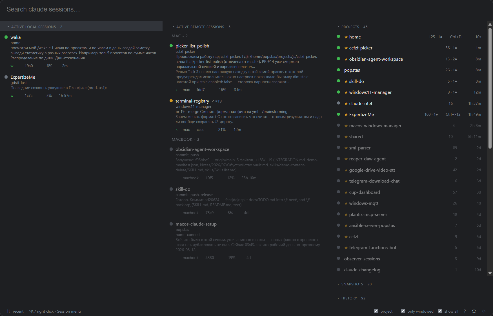

# ccfzf-picker

A picker for Claude Code sessions living on a remote machine. The list arrives
over ssh from the `ccfzf` aggregator, the window and global hotkeys are Tauri 2,
and a session opens in the terminal of your choice.



*[Русская версия](README_ru.md)*

## Features

- **One search line for every panel** — with five mode prefixes (`/l`, `/r`,
  `/h`, `/p`, `/s`) to narrow to one. A forgotten keyboard layout still finds
  it: `зшслук` matches `picker`.
- **Sessions from every machine** — yours on the left, other machines' in the
  middle, grouped by host and ordered by freshness.
- **Projects panel** — favourites, session counts, per-project hotkeys, and a
  dim of everything that does not belong to the project you point at.
- **Status at a glance** — a colored circle per session (working, asking,
  finished-unread, idle, closed), the terminal it is open in, context used, and
  the age of the last activity.
- **Enter opens the session** — in a terminal, or back inside Claude Desktop for
  the sessions that came from it.
- **Raises windows instead of opening new ones** — over MQTT, together with the
  [window tracker](https://github.com/popstas/macos-windows-manager).
- **Tile and cascade layouts** — a global hotkey asks the tracker to arrange the
  windows in the order you see in the list.
- **Layout snapshots** — `^S` restores a whole remembered arrangement of
  sessions, or one window out of it.
- **Wide mode** — `^F` turns the list into a dashboard: a session card next to
  blocks of groups, projects and snapshots, each with its own scroll.
- **Configurable without editing files** — a settings window for hotkeys,
  columns, panel layout, window size and MQTT.
- **Works with the window closed** — background polling keeps the list ready and
  the aggregator's dump fresh for Home Assistant and openHASP.

## Install

### Prebuilt

Every `v*` tag publishes a Windows installer and a macOS app to the
[releases page][releases].

**Windows** — download `*-setup.exe` and run it. It installs into the user
profile and does not ask for administrator rights.

**macOS** (Apple Silicon):

```sh
brew trust --tap popstas/apps
brew install --cask --no-quarantine popstas/apps/ccfzf-picker
```

Homebrew 6.0.0+ will not load casks from an untrusted tap, so `brew trust` comes
first — once per tap, not per application. A separate `brew tap` is not needed:
`brew install user/tap/cask` does it itself.

`--no-quarantine` is mandatory here: the app is not signed with a Developer ID,
and without it Gatekeeper says "damaged" — which looks more like a broken build
than like a missing signature. Intel Macs are not supported: the build is arm64
only.

[releases]: https://github.com/popstas/ccfzf-picker/releases

### From source

```sh
git clone --recurse-submodules https://github.com/popstas/ccfzf-picker
npm test                      # frontend tests
cd src-tauri && cargo test    # shell tests
cargo tauri build             # build
```

Requires Rust, Node 22+ and `tauri-cli` (`cargo install tauri-cli`); the remote
machine needs `ccfzf`. The submodules are not optional — the vendored aggregator
is compiled into the binary.

→ Layout of the source tree and what each script does:
[docs/architecture.md](docs/architecture.md).

## Configuration

Copy `config.example.yml` to `~/.config/ccfzf-picker/config.yaml` (on Windows,
`%USERPROFILE%\.config\ccfzf-picker\config.yaml`) and set `sshHost`. There is
deliberately no default host — without one the picker says the config is not set
up. Every field is documented by a comment in `config.example.yml`.

Three things worth knowing before reaching for the file:

- `localSource: true` adds a second source — the picker runs `ccfzf --state` on
  this machine as well, without ssh, and shows both lists as one.
- `pathMap` maps remote directories onto local ones, which is what turns on the
  folder-opening actions from `actions`.
- A matching `windowHost` plus a reachable manager is what enables window
  raising, layout snapshots and tiling — reachable meaning either the tracker
  announced a direct address, or `mqtt` is configured as a fallback.

→ All three in full, plus background refresh:
[docs/configuration.md](docs/configuration.md).

## Settings window

The gear in the status line (or `Ctrl+,` / `Cmd+,`) opens a settings window with
tabs for General, Window popup, Columns, Layout panels, Hotkeys, MQTT and Paths.
Edits save themselves and apply at once, hotkeys included — no restart.

Note that saving rewrites `config.yaml` in full and **does not preserve its
comments**, keeping the previous version as `config.yaml.bak`.

→ Every tab, and the saving rules: [docs/settings.md](docs/settings.md).

## Documentation

- [docs/interface.md](docs/interface.md) — panels, the session row, keys, status line
- [docs/configuration.md](docs/configuration.md) — `config.yaml`, local sources, path mapping, MQTT
- [docs/settings.md](docs/settings.md) — the settings window
- [docs/architecture.md](docs/architecture.md) — source layout, build and tests
- [docs/window-layouts.md](docs/window-layouts.md) — asking the tracker to tile or cascade (ru)
- [docs/TODO.md](docs/TODO.md) — what is deferred, and why (ru)
- [CLAUDE.md](CLAUDE.md) — build rules and the bugs already paid for (ru)

## Related

- [ccfzf](https://github.com/popstas/ccfzf) — the aggregator this picker reads.
- [macos-windows-manager](https://github.com/popstas/macos-windows-manager) —
  the window tracker that binds terminal windows to sessions and lays them out.
